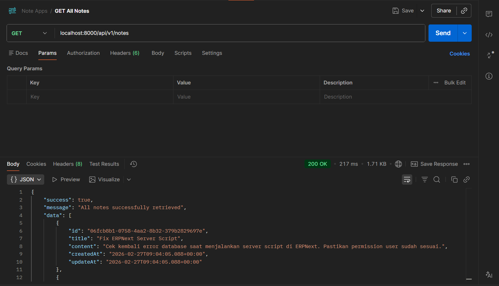
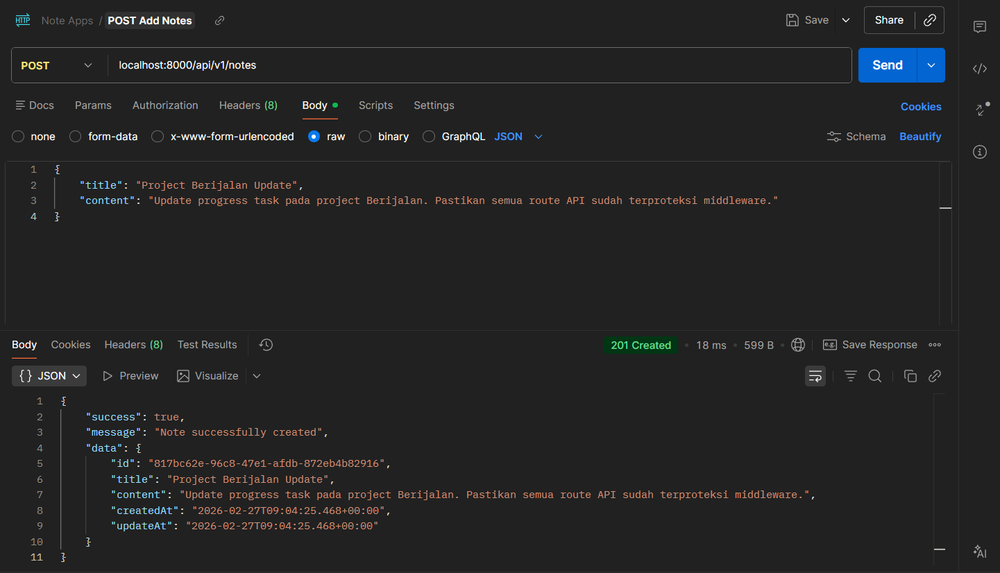
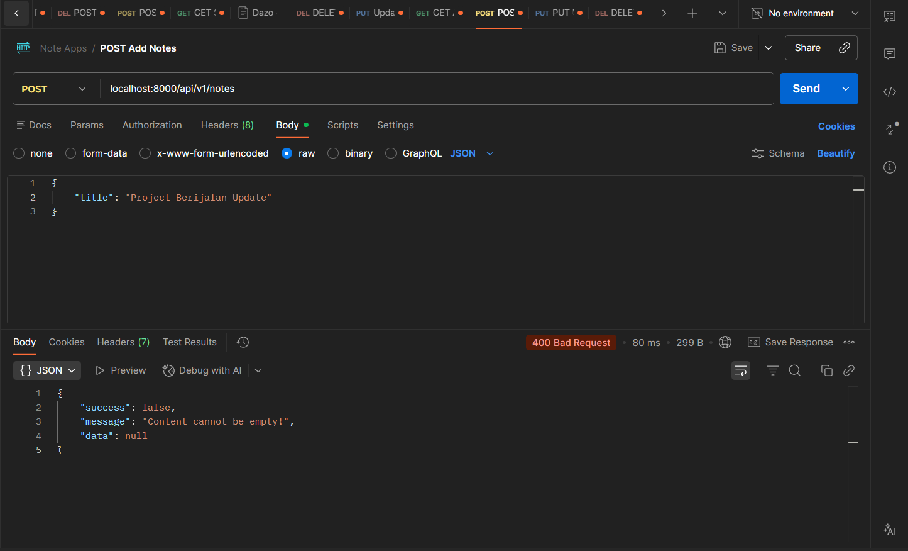
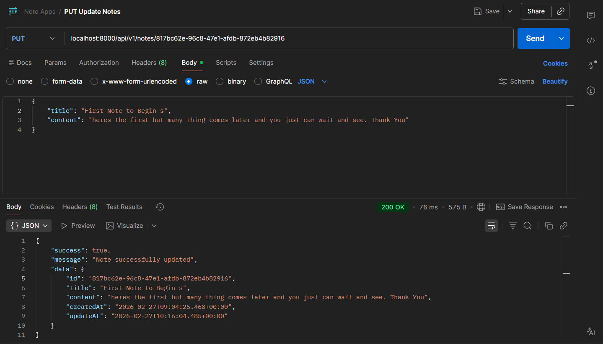
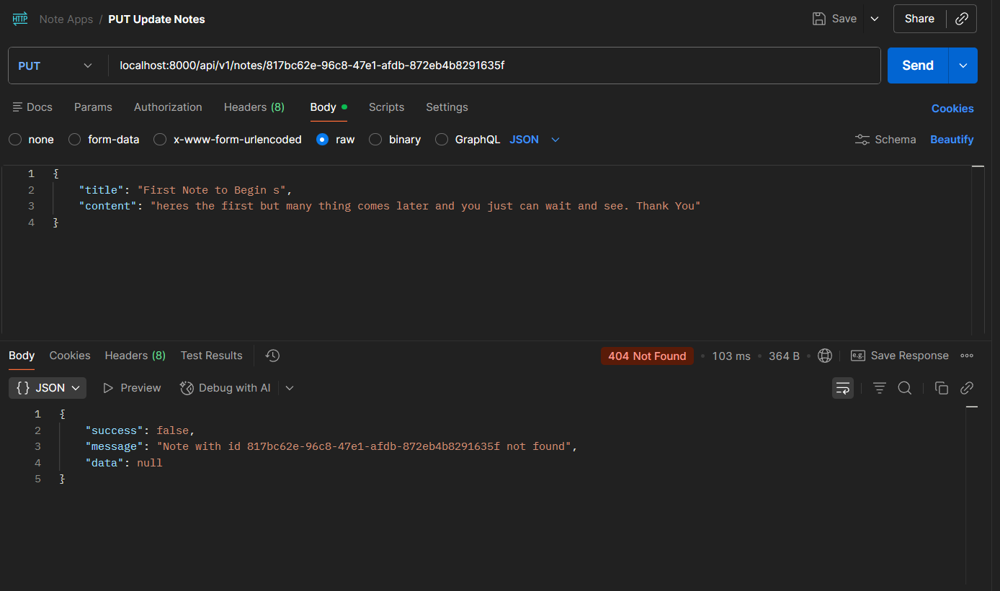
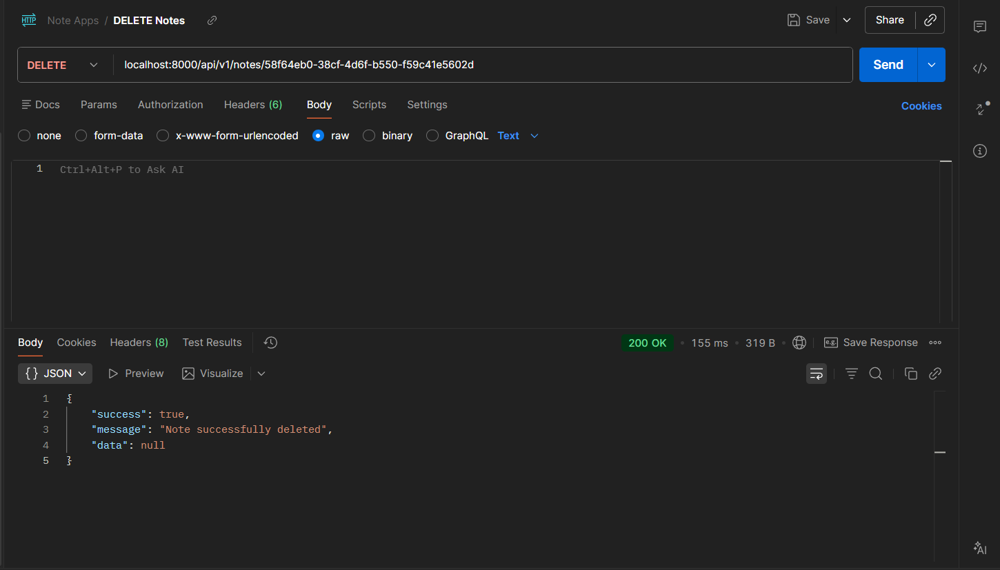
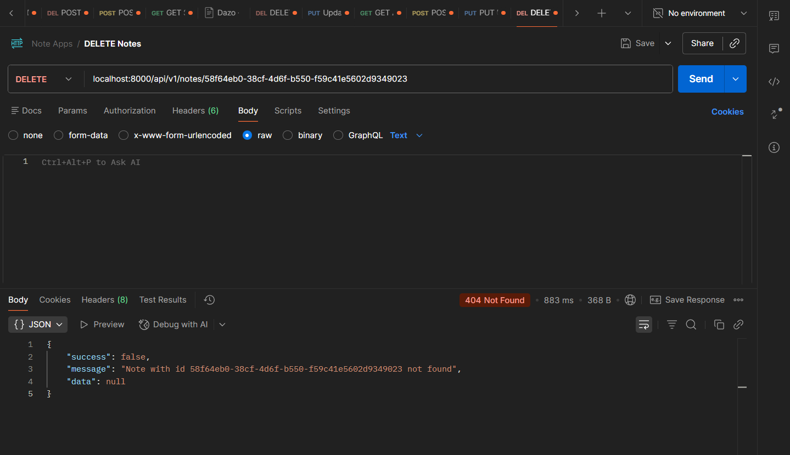

# Spring Boot Astrapay Base Project - Simple Note App API
Berikut adalah Base Project untuk aplikasi Spring Boot, yang sesuai dengan konvensi yang digunakan pada Astrapay.

## Prerequisites
- Java 17 or higher
- Maven 3.9 +
- Git

## Quick Start
1. Clone the Repository
```
https://github.com/Kusumojakti/astrapay-spring-boot-external.git
cd astrapay-spring-boot-external
```
2. Build application
```
mvn clean compile
```
3. Run the Application
```
mvn spring-boot:run
```
4. Running the Application
- After run success, the application will active on http://localhost:8000/api/v1/notes

### API Endpoints
| Method | Endpoint | Description | Request Body |
| :--- | :--- | :--- | :--- |
| **GET** | `/api/v1/notes` | Take All List of Notes | - |
| **POST** | `/api/v1/notes` | Create new nNotes | `{ "title": "...", "content": "..." }` |
| **PUT** | `/api/v1/notes/{id}` | Update new Notes | `{ "title": "...", "content": "..." }` |
| **DELETE** | `/api/v1/notes/{id}` | Delete Nots | - |

## Response/Request

**GET** All Data Notes

**Response**
```
{
    "success": true,
    "message": "All notes successfully retrieved",
    "data": [
        {
            "id": "58f64eb0-38cf-4d6f-b550-f59c41e5602d",
            "title": "Welcome to Docket",
            "content": "Ini adalah catatan pertama di aplikasi Docket. Mari mulai mencatat ide-ide brilianmu di sini!",
            "createdAt": "2026-02-27T09:03:54.417+00:00",
            "updateAt": "2026-02-27T09:03:54.418+00:00"
        },
        {
            "id": "9628a3cc-591d-4eef-87a4-32621373ea31",
            "title": "Techno & EDM Playlist",
            "content": "Cari lagu techno dengan drop yang sicker untuk teman coding malam ini agar lebih fokus.",
            "createdAt": "2026-02-27T09:04:19.094+00:00",
            "updateAt": "2026-02-27T09:04:19.094+00:00"
        }
    ]
}
```
**POST & PUT** Created and Update Data Notes

**Request**
```
{
    "title": "Project Berijalan Update",
    "content": "Update progress task pada project Berijalan. Pastikan semua route API sudah terproteksi middleware."
}
```
**Response**
```
{
    "success": true,
    "message": "Note successfully created",
    "data": {
        "id": "817bc62e-96c8-47e1-afdb-872eb4b82916",
        "title": "Project Berijalan Update",
        "content": "Update progress task pada project Berijalan. Pastikan semua route API sudah terproteksi middleware.",
        "createdAt": "2026-02-27T09:04:25.468+00:00",
        "updateAt": "2026-02-27T09:04:25.468+00:00"
    }
}
```

**DELETE** All Data Notes

**Response**
```
{
    "success": true,
    "message": "Note successfully deleted",
    "data": null
}
```
## API Preview

**GET All Notes**



**POST Success Data**



**POST Error Data**



**PUT Update Data**



**PUT Error Update Data**



**DELETE Notes Data**



**DELETE Notes Data**




## Testing

**Run Testing**
```
mvn test
```
**Testing Coverage**
- Unit Testing : Test API Service to make sure all API can working so well

## CURL
1. GET Get all list data
```
curl --location 'localhost:8000/api/v1/notes'
```
2. POST Create Data
```
curl --location 'localhost:8000/api/v1/notes' \
--header 'Content-Type: application/json' \
--data '{
    "title": "Project Berijalan Update",
    "content": "Update progress task pada project Berijalan. Pastikan semua route API sudah terproteksi middleware."
}'
```
3. PUT Update Data
```
curl --location --request PUT 'localhost:8000/api/v1/notes/817bc62e-96c8-47e1-afdb-872eb4b82916' \
--header 'Content-Type: application/json' \
--data '{
    "title": "First Note to Begin s",
    "content": "heres the first but many thing comes later and you just can wait and see. Thank You"
}'
```
4. DELETE Delete Notes Data
```
curl --location --request DELETE 'localhost:8000/api/v1/notes/58f64eb0-38cf-4d6f-b550-f59c41e5602d' \
--data ''
```

## Project Structured
```
src/
├── main/
│   ├── java/com/astrapay/
│   │   ├── controller/          
│   │   ├── service/             
│   │   ├── model/               
│   │   ├── dto/                 
│   │   ├── exception/                     
│   └── resources/
│       └── application.properties
└── test/
    └── java/com/astrapay/
        └── service/             # Service Tests
```
## License
This project is part of the Astrapay Spring Boot base project.

Happy Coding!
